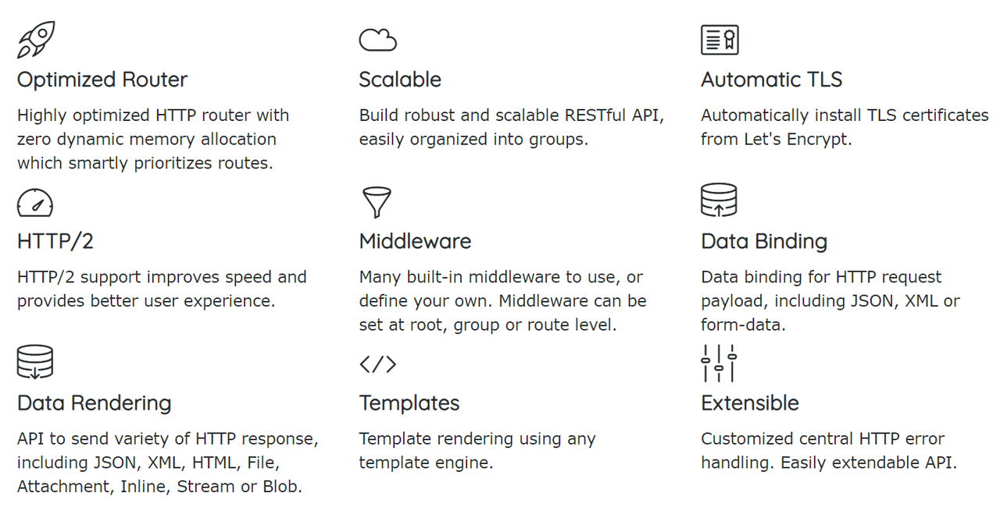
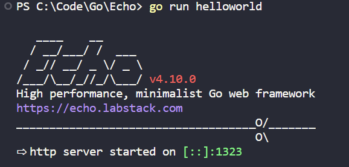
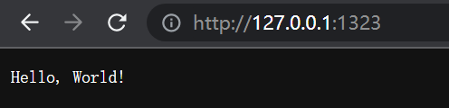
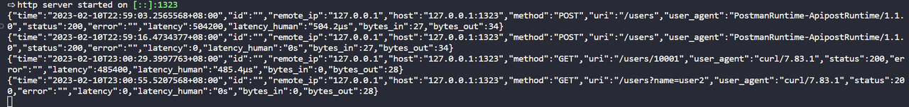
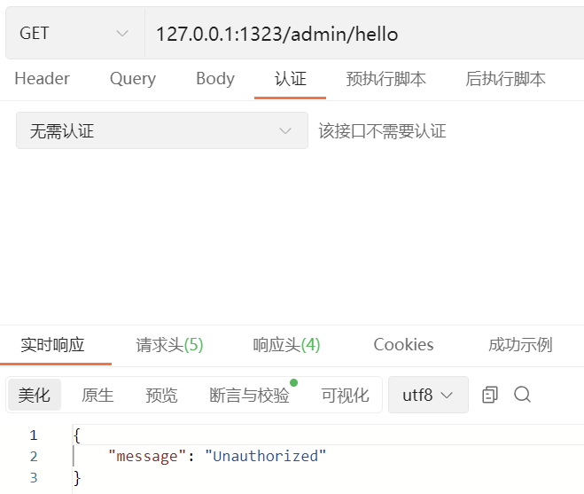
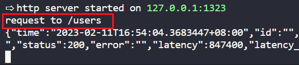
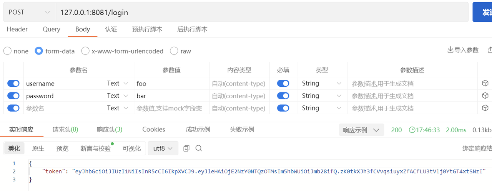

# Echo

## 简介

先贴个官网链接：[Echo - High performance, minimalist Go web framework](https://echo.labstack.com/)

具体内容还是参考官网的文档。

下面是官网的一些介绍，可以大致了解到这个框架是干什么的。



那么，正式介绍一下，Echo 是一个高性能，极简的 Web 框架。可以用几行代码，启动一个http server 端。负责管理路由和处理 http 请求。

> echo框架默认其实只包含了MVC框架的C部分，就是负责url路由和控制器部分。至于V视图部分和M数据操作部分我们可以随意使用自己喜欢的工具库来操作。
>
> 引自：https://www.tizi365.com/archives/28.html

## 使用

### 快速开始

#### 初始代码

 初始化一个go项目

```powershell
go mod init helloworld
```

添加如下代码

```go
package main

import (
        "net/http"
        
        "github.com/labstack/echo/v4"
)

func main() {
        e := echo.New()
        e.GET("/", func(c echo.Context) error {
                return c.String(http.StatusOK, "Hello, World!")
        })
        e.Logger.Fatal(e.Start(":1323"))
}
// 添加依赖
go mod tidy 
// 运行代码
go run helloworld
```



看到上面的，就成功啦。然后就可以在浏览器进行访问。



好了，你已经学会了最简单的例子。

#### 路由监听

 下面我们需要监听其它路由，只需要继续添加就好了，比如我们想要下面这些：

```go
    e.POST("/users", saveUser)
    e.GET("/users/:id", getUserByIdFromPathParameters)
    e.GET("/users", getUserByIdFromQueryParameters)
    e.GET("/all",getAllUsers)
    e.PUT("/users/:id", updateUser)
    e.DELETE("/users/:id", deleteUser)
```

#### 处理请求

这样就可以监听这些路由，在运行之前，我们需要完成相应的处理函数。

```go
type User struct {
    Id   int64  `json:"id"`
    Name string `json:"name"`
}

var users []User

func saveUser(c echo.Context) error {
    var user User
    err := c.Bind(&user)
    if err != nil {
        return err
    }
    users = append(users, user)
    return c.String(http.StatusOK, "Save Success! "+"name:"+user.Name+", id:"+strconv.FormatInt(user.Id, 10))
}

func getUserByIdFromPathParameters(c echo.Context) error {
    id, _ := strconv.ParseInt(c.Param("id"), 10, 64)
    var user User
    for _, v := range users {
        if v.Id == id {
            user = v
        }
    }
    return c.JSON(http.StatusOK, user)
}

func getUserByIdFromQueryParameters(c echo.Context) error {
    name := c.QueryParam("name")
    var user User
    for _, v := range users {
        if v.Name == name {
            user = v
        }
    }
    return c.JSON(http.StatusOK, user)
}
```

其它几个处理函数有兴趣可以自己完成，让我们先来试一试效果吧。


#### 中间件

请求有得到预期的结果吗？对于现在这样比较简单的api，应该是很容易的。如果api多起来呢？查找错误就不太容易了，为此，我们可以为 echo 加上日志。

```go
    e.Use(middleware.Logger())
```



这样是不是就清晰多啦。本例中，我们使用了 echo 自带的Logger，当然，你也可以用其他的日志管理包，比如 logrus 。

```go
    log := logrus.New()
    e.Use(middleware.RequestLoggerWithConfig(middleware.RequestLoggerConfig{
        LogURI:    true,
        LogStatus: true,
        LogValuesFunc: func(c echo.Context, values middleware.RequestLoggerValues) error {
            log.WithFields(logrus.Fields{
                "URI":    values.URI,
                "status": values.Status,
            }).Info("request")

            return nil
        },
    }))
```


相信你已经发现了，这里我们使用了 e.Use(middleware.XXXX) 也就是中间件。它还用于身份验证之类的。

中间件可以用在不同级别，需要根据具体业务场景进行选择。

```go
// Root level middleware
e.Use(middleware.Logger())
e.Use(middleware.Recover())

// Group level middleware
g := e.Group("/admin")
g.Use(middleware.BasicAuth(func(username, password string, c echo.Context) (bool, error) {
  if username == "joe" && password == "secret" {
    return true, nil
  }
  return false, nil
}))
e.GET("/admin/hello",func(c echo.Context) error {
  return c.String(http.StatusOK,"Hi!")
})
// Route level middleware
track := func(next echo.HandlerFunc) echo.HandlerFunc {
        return func(c echo.Context) error {
                println("request to /users")
                return next(c)
        }
}
e.GET("/users", func(c echo.Context) error {
        return c.String(http.StatusOK, "/users")
}, track)
```

上面的 Root level 中间件，全局有效。Recovery 中间件用于异常*恢复*，服务出现异常的情况下，打印堆栈的错误信息，并将错误集中交给HTTPErrorHandler 处理，防止程序直接退出。Logger 中间件用于记录有关每个 HTTP 请求的信息。

Group level 中间件，对路由 /admin 及其次级路由有效。比如上面的 middleware.BasicAuth ，当访问 /admin 或 /admin/XXX 时，进行身份验证。

下面看一下效果

 未认证：



 认证：


Route level 中间件，只对特定路由有效。

效果如下



#### 总结一下

在刚刚的小练习中，我们学到了什么呢?

- 使用 e.POST e.GET 等监听路由
- 写相应路由的处理函数
- 使用 c.Bind(&user) 将接收到的 json 数据绑定到结构体变量 user
- 使用 c.Param() 解析路径参数（/users/10001）
- 使用 c.QueryParam() 解析查询参数 (/users?name=user2)
- 了解了中间件的不同级别
- 使用 BasicAuth 中间件进行身份验证

这只是一篇入门文档，掌握以上内容足以。其它内容可以开发时再学，查找官方文档很快的。

## 重要内容

这里列出一些需要关注的内容

### [Binding](https://echo.labstack.com/guide/binding)

```go
type User struct {
  ID string `param:"id" query:"id" form:"id" json:"id" xml:"id"`
}
err := (&DefaultBinder{}).BindBody(c, &payload)
err := (&DefaultBinder{}).BindQueryParams(c, &payload)
err := (&DefaultBinder{}).BindPathParams(c, &payload)
err := (&DefaultBinder{}).BindHeaders(c, &payload)
```

### [Cookies](https://echo.labstack.com/guide/cookies)

```go
func writeCookie(c echo.Context) error {
        cookie := new(http.Cookie)
        cookie.Name = "username"
        cookie.Value = "jon"
        cookie.Expires = time.Now().Add(24 * time.Hour)
        c.SetCookie(cookie)
        return c.String(http.StatusOK, "write a cookie")
}
func readCookie(c echo.Context) error {
        cookie, err := c.Cookie("username")
        if err != nil {
                return err
        }
        fmt.Println(cookie.Name)
        fmt.Println(cookie.Value)
        return c.String(http.StatusOK, "read a cookie")
}

func readAllCookies(c echo.Context) error {
        for _, cookie := range c.Cookies() {
                fmt.Println(cookie.Name)
                fmt.Println(cookie.Value)
        }
        return c.String(http.StatusOK, "read all the cookies")
}
```

### [HTTP(s) Server](https://echo.labstack.com/guide/http_server)

Https 需要证书和密钥

- HTTPS

```go
func main() {
  e := echo.New()
  // add middleware and routes
  // ...
  if err := e.StartTLS(":8443", "server.crt", "server.key"); err != http.ErrServerClosed {
    log.Fatal(err)
  }
}
```

- HTTP2

```go
func main() {
  e := echo.New()
  // add middleware and routes
  // ...
  s := &http2.Server{
    MaxConcurrentStreams: 250,
    MaxReadFrameSize:     1048576,
    IdleTimeout:          10 * time.Second,
  }
  if err := e.StartH2CServer(":8080", s); err != http.ErrServerClosed {
    log.Fatal(err)
  }
}
```

目前主流浏览器都只支持加密的HTTP2

### [IP Address](https://echo.labstack.com/guide/ip-address)

当使用代理或通过nginx等转发请求时，如果需要ip，请参考此项。

下面是一些为了安全的考虑：

> 1. 直接对外提供服务的 Web 应用，在进行与安全有关的操作时，只能通过 Remote Address 获取 IP，不能相信任何请求头；
> 2. 使用 Nginx 等 Web Server 进行反向代理的 Web 应用，在配置正确的前提下，要用 `X-Forwarded-For` 最后一节 或 `X-Real-IP` 来获取 IP（因为 Remote Address 得到的是 Nginx 所在服务器的内网 IP）；同时还应该禁止 Web 应用直接对外提供服务；
> 3. 在与安全无关的场景，例如通过 IP 显示所在地天气，可以从 `X-Forwarded-For` 靠前的位置获取 IP，但是需要校验 IP 格式合法性；
>
> 引自：https://www.runoob.com/w3cnote/http-x-forwarded-for.html

提示：什么是`X-Forwarded-For`？它有什么用？

### [Response](https://echo.labstack.com/guide/response)

包含以下内容，使用时直接 c.String() 这样就可以了。直接根据代码提示写就可以。当数据量较大时，使用流式传输是一个好主意。

> - [Send String](https://echo.labstack.com/guide/response/#send-string)
> - [Send HTML (Reference to templates)](https://echo.labstack.com/guide/response/#send-html-reference-to-templates)
>   - [Send HTML Blob](https://echo.labstack.com/guide/response/#send-html-blob)
> - [Render Template](https://echo.labstack.com/guide/response/#render-template)
> - [Send JSON](https://echo.labstack.com/guide/response/#send-json)
>   - [Stream JSON](https://echo.labstack.com/guide/response/#stream-json)
>   - [JSON Pretty](https://echo.labstack.com/guide/response/#json-pretty)
>   - [JSON Blob](https://echo.labstack.com/guide/response/#json-blob)
> - [Send JSONP](https://echo.labstack.com/guide/response/#send-jsonp)
> - [Send XML](https://echo.labstack.com/guide/response/#send-xml)
>   - [Stream XML](https://echo.labstack.com/guide/response/#stream-xml)
>   - [XML Pretty](https://echo.labstack.com/guide/response/#xml-pretty)
>   - [XML Blob](https://echo.labstack.com/guide/response/#xml-blob)
> - [Send File](https://echo.labstack.com/guide/response/#send-file)
> - [Send Attachment](https://echo.labstack.com/guide/response/#send-attachment)
> - [Send Inline](https://echo.labstack.com/guide/response/#send-inline)
> - [Send Blob](https://echo.labstack.com/guide/response/#send-blob)
> - [Send Stream](https://echo.labstack.com/guide/response/#send-stream)
> - [Send No Content](https://echo.labstack.com/guide/response/#send-no-content)
> - [Redirect Request](https://echo.labstack.com/guide/response/#redirect-request)
> - [Hooks](https://echo.labstack.com/guide/response/#hooks)
>   - [Before Response](https://echo.labstack.com/guide/response/#before-response)
>   - [After Response](https://echo.labstack.com/guide/response/#after-response)

### [Routing](https://echo.labstack.com/guide/routing)

#### 路由匹配顺序：

1. Static
2. Param
3. Match any

*Example*

```go
e.GET("/users/:id", func(c echo.Context) error {return c.String(http.StatusOK, "/users/:id")})

e.GET("/users/new", func(c echo.Context) error {return c.String(http.StatusOK, "/users/new")})

e.GET("/users/1/files/", func(c echo.Context) error {return c.String(http.StatusOK, "/users/1/files/")})
```

Above routes would resolve in the following order:

1. `/users/new`
2. `/users/:id`
3. `/users/1/files/*`

#### Group

实际开发中，通常将所有路由放在一个文件内，并使用 Group 合并相同前缀。

```go
g := e.Group("/api")
g.GET("/getUser", getUser) /* /api/getUser */
g.POST("/newUser", newUser) /* /api/newUser */
```

### 中间件

#### [CORS](https://echo.labstack.com/middleware/cors)

CORS 中间件实现了[CORS](http://www.w3.org/TR/cors)规范。CORS 为 Web 服务器提供跨域访问控制，从而实现安全的跨域数据传输。

*用法：*

```go
//默认配置
e.Use(middleware.CORS())    

//自定义配置
e.Use(middleware.CORSWithConfig(middleware.CORSConfig{
  AllowOrigins: []string{"https://labstack.com", "https://labstack.net"},
  AllowHeaders: []string{echo.HeaderOrigin, echo.HeaderContentType, echo.HeaderAccept},
}))
```

#### [JWT](https://echo.labstack.com/middleware/jwt)（JSON Web Token 认证中间件）

- 对于有效令牌，它在上下文中设置用户并调用下一个处理程序。
- 对于无效令牌，它会发送“401 - 未经授权”响应。
- 对于丢失或无效的`Authorization`标头，它会发送“400 - Bad Request”。

用于 Bearer 认证。

Example：

```go
package main

import (
    "log"
    "net/http"
    "time"

    "github.com/golang-jwt/jwt"
    "github.com/labstack/echo-jwt/v4"

    "github.com/labstack/echo/v4"
)

func login(c echo.Context) error {
    username := c.FormValue("username")
    password := c.FormValue("password")
    // Throws unauthorized error
    if username == "foo" && password == "bar" {
        // Create token
        token := jwt.New(jwt.SigningMethodHS256)
        // Set claims
        claims := token.Claims.(jwt.MapClaims)
        claims["name"] = username
        claims["exp"] = time.Now().Add(time.Hour * 72).Unix()
        // Generate encoded token and send it as response.
        t, err := token.SignedString([]byte("secret")) //密钥
        if err != nil {
            return err
        }
        return c.JSON(http.StatusOK, map[string]string{"token": t})
    } else {
        return echo.ErrUnauthorized
    }
}

func main() {
    e := echo.New()

    // Login route
    e.POST("/login", login)

    g := e.Group("/api")
    g.Use(echojwt.JWT([]byte("secret")))

    g.GET("/ping", func(c echo.Context) error {
        return c.String(200, "Pong")
    })

    if err := e.Start("127.0.0.1:8081"); err != http.ErrServerClosed {
        log.Fatal(err)
    }
}
```

试试效果

未认证：


登录获取token：



经过认证：


#### [Rate Limiter](https://echo.labstack.com/middleware/rate-limiter)

该中间件可以限制访问量。

#### [Static](https://echo.labstack.com/middleware/static)

该中间件提供静态文件访问。

## 示例

建议查看以下内容 [cookbook](https://echo.labstack.com/cookbook)，对于较难理解的内容，提供了相应的代码。

包含的内容如下：

- [Auto TLS](https://echo.labstack.com/cookbook/auto-tls)
- [CORS](https://echo.labstack.com/cookbook/cors)
- [CRUD](https://echo.labstack.com/cookbook/crud)
- [Embed Resources](https://echo.labstack.com/cookbook/embed-resources)
- [File Download](https://echo.labstack.com/cookbook/file-download)
- [File Upload](https://echo.labstack.com/cookbook/file-upload)
- [Google App Engine](https://echo.labstack.com/cookbook/google-app-engine)
- [Graceful Shutdown](https://echo.labstack.com/cookbook/graceful-shutdown)
- [Hello World](https://echo.labstack.com/cookbook/hello-world)
- [HTTP/2](https://echo.labstack.com/cookbook/http2)
- [HTTP/2 Server Push](https://echo.labstack.com/cookbook/http2-server-push)
- [JSONP](https://echo.labstack.com/cookbook/jsonp)
- [JWT](https://echo.labstack.com/cookbook/jwt)
- [Load Balancing](https://echo.labstack.com/cookbook/load-balancing)
- [Middleware](https://echo.labstack.com/cookbook/middleware)
- [Reverse Proxy](https://echo.labstack.com/cookbook/reverse-proxy)
- [Streaming Response](https://echo.labstack.com/cookbook/streaming-response)
- [Subdomains](https://echo.labstack.com/cookbook/subdomains)
- [Timeouts](https://echo.labstack.com/cookbook/timeouts)
- [Twitter](https://echo.labstack.com/cookbook/twitter)
- [WebSocket](https://echo.labstack.com/cookbook/websocket)