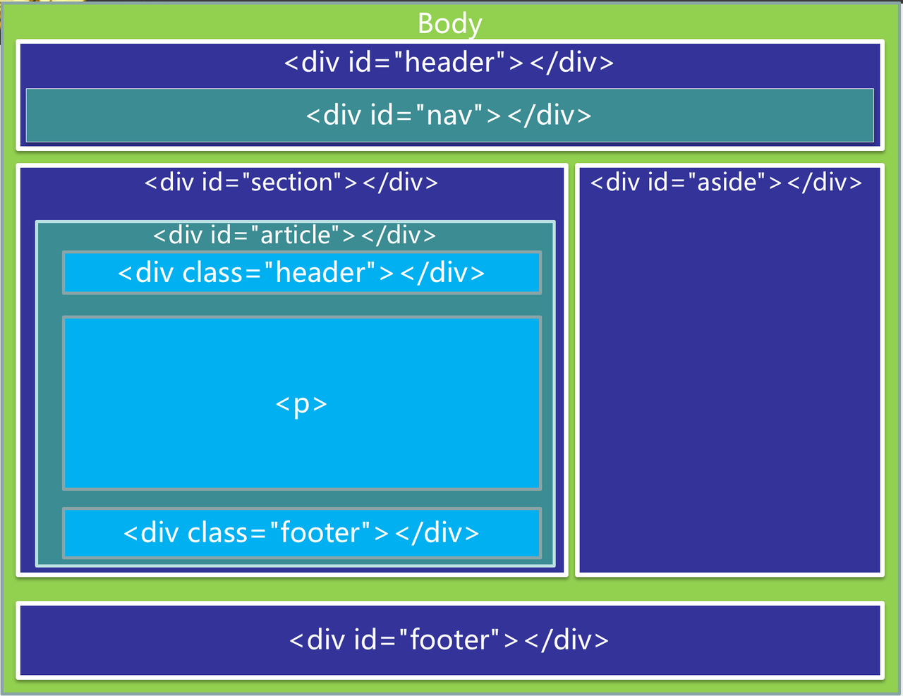
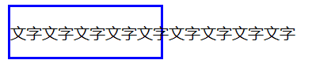
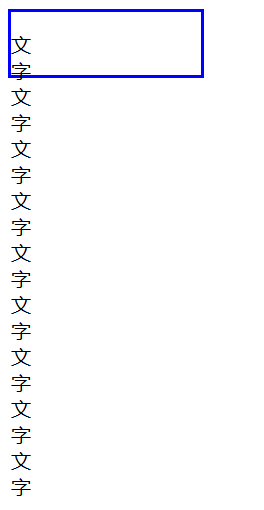
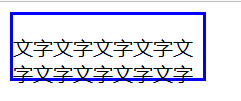
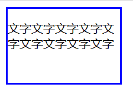
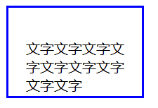
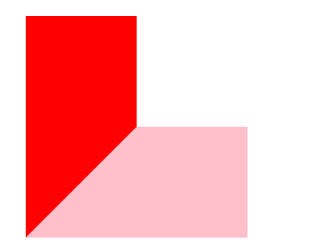
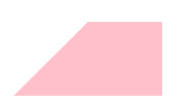

# Box model

@阿董

## 盒模型简介

让我们回忆一下，在HTML&CSS的学习过程中，我们会接触到各种各样的html元素：段落、区块、标题、表格……数不胜数。而相信大家也一定都对元素的排布规律有了感觉：每个html元素的CSS规则都可以规定其长、宽，都有边框和间距这些东西来帮助我们进行页面布局的排版，就跟下面这张图一样。



（图源自https://blog.csdn.net/boring_cat/article/details/50950357）

好像所有的html元素都是一块矩形。折线矩形拥有自己的长和宽，可以对边框进行修改，间距通过每块矩阵间的水平和垂直距离隔开——像是大大小小的盒子通过俄罗斯方块的模式堆叠在了一起。

这就是CSS BOX MODEL（盒模型）。用一句话来说，每一个HTML元素都可以看作是一个矩形的盒子。因此HTML的布局也就变成了对每个盒子的大小数值、边距等等的排布。

对于IE和标准这两种浏览器的盒模型来说，它们的边距计算略有区别，但是包含的元素以及排布方式是不变的：一个盒模型从内到外拥有其`width&height，padding，border，margin`这几种大小和布局元素。接下来将对这些元素做出介绍。


（例：chrome中的盒模型）

## 盒模型中的元素

### Width & Height

设置盒模型的宽度和高度，在上面的图中反应为content的宽度和高度（这一点在IE和标准中不一样，下面再讲）。

这个属性非常的直观，大家也很好理解，这里汇总一下可能的写法

| 写法        | 含义                                                               |
| ----------- | ------------------------------------------------------------------ |
| 数值        | 用绝对值数值定义（带单位）                                         |
| 百分数      | 按照外层容器的长宽百分比地为元素分配长宽                           |
| auto        | 按浏览器的默认分配长宽                                             |
| max-content | 内容有多宽，盒子就有多宽，不会顾及父级盒子有多宽，只满足自己的需求 |
| min-content | 装得下盒子内单个最大内容的最小宽度                                 |
| fit-content | 跟max比较像，但是会顾及父级盒子的宽度尽量撑开                      |

可能几个content不是很好理解，给出几个例子演示一下：

基础代码：

```html
  <div class="web">
    <p class="text">文字文字文字文字文字文字文字文字文字</p>
  </div>
```

```css
.web {
  height: 50px;
  width: 10%;
  border: solid blue;
}

.text {
  width: ;
}
```

①max-content：只管自己，不管父级



```css
.text {
  width: max-content;
}
```

②min-content：尽量缩小父级的体型



```css
.text {
  width: min-content;
}
```

③fit-content：体型跟父亲和睦相处



```css
.text {
  width: fit-content;
}
```

### Padding

padding用于定义元素边框与元素内容之间的空间，即上下左右的内边距

内边距还是可以看这张图


盒子的内容和边框的距离就是padding，比较好理解，也可以从例子看看：

这是初始状态：



增加了padding后，可以发现隔开了：



padding为设置四个方位的padding，分padding-top、padding-left、padding-right、padding-bottom，各自设置各自方位的padding值。

或者也可以在padding后接n个变量分别设置。

### Border

border即盒模型的边框，这个想必非常直观。border有非常多的内容，但都是比较直观的，在这里就不大费周章地单独介绍了。需要的朋友可以去[菜鸟教程](https://www.runoob.com/css/css-border.html)访问一手。

- 可以在`border：`后面跟任意对应值完成对`border-width、border-color`和`border-style`的设置，顺序不限。
- 如果想让border的各类设置可见，我们首先应该使`border-style`不为默认值`none`，否则`border`将一直不可见
- 不同类型的border-style可以见下。垄状应为向屏幕外凸起，对应凹槽向屏幕内凹陷；而嵌入则是斜面向元素中央屏幕内部凹陷，外凸是斜面向元素中央屏幕内部凸出。


- bottom同样可以单独对top、left、right、bottom进行设置。
- 有一个有趣的现象是我们必须明白的：上述四类型的边框连接处是一条45度的斜线。如下图：



```css
.borderex{
    border-bottom: 100px solid pink; 
    border-left: 100px solid red; 
    height: 100px; 
    width: 100px;
    }
```

利用这一点我们可以画一些斜线图形。比如将height变为0再将red的部分变为隐藏色后：



```css
.borderex{
    border-bottom: 100px solid pink; 
    border-left: 100px solid transparent; 
    width: 100px;
    }
```

此外，radius属性可以设置边框的圆角，给形状更多的变化可能

- 设置为inherit可以从父元素处继承边框属性

### Margin

margin用于定义元素边框与其他元素边框之间的空间，即上下左右的外边距

逻辑和用法与padding完全相同。


盒子的和其他元素（或者是屏幕边界）的距离就是margin

## IE VS 标准

总的来说，标准盒和IE盒的区别只在于：

标准盒模型：`width/height = content`，**不包含border和padding**; IE 盒模型： `width/height = content + padding + border`，**包含 border和padding**。

我们可以通过box-sizing这个属性来定义使用标准盒模型还是IE盒模型

