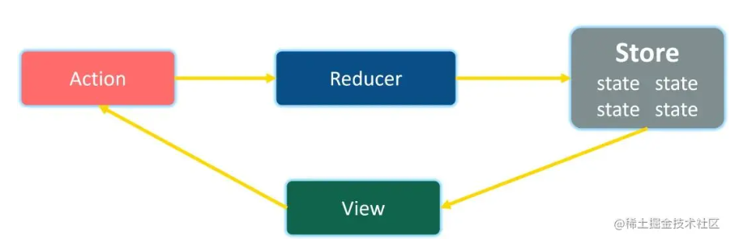

# React

@biu9

## react 及其生态简介

这篇文章的主要目的是介绍 react 社区中各种插件/包,并为创建一个 react 应用提供相应的建议，由于整篇文章是综述性质的，因此不会过多涉及每个插件/包的高级用法，我们在这里只展示初级用法，如果你想要更进一步，你可以阅读本文的推荐阅读或直接去官网看文档

本文主要会涉及到以下内容

- redux / mobx
- react-query
- clean code
- eslint / husky / jest
- a clear project structure
- css 预处理器 less / scss / tailwind

## 初始化代码环境

由于 react 只是一个 JavaScript library,因此我们需要别的包配合以构建一个完整的 react 应用,框架在这一过程中起的是减轻开发者初始化代码环境负担的作用

目前比较主流的 react 框架有如下几种

1. create-react-app
2. next.js
3. vite

每种框架都有自己的优点 × ,在这里我们用 create-react-app 初始化代码环境

初始化的一些指令在此就不赘述了,在初始化完之后,我们首先来修改 src 文件夹下的文件结构

> 我认为一个清晰的文件结构对于开发是有很大帮助的

scr 文件夹下可以分成以下几个目录

- assets,存放项目中用到的所有静态资源文件
- components,存放可以被复用的组件
- hooks,存放自定义的 hook 函数
- routes,应该是有关路由的文件夹,内部应该会和 protect routes 等有关(但我还没学 ×)
- store,使用 redux / mobx 等全局状态管理工具时需要的 store
- test,存放单元测试文件的地方
- types,自定义的可以复用的各种 type
- utils,自定义的纯函数
- pages,页面文件夹
- config,一些全局常量,如请求的 server 名

对于 pages 文件夹,里面的每一个 page 都应该由以下部分组成

- index.tsx
- components
- api,存放各种封装好的请求的文件夹
- types
- style,存放样式文件(但用 tailwind 就不用这个目录了 ×

> 为什么 pages 里面有 types 却没有 hooks / utils 呢
>
> 从我个人的开发经验来看,自定义的 hook / util 的复用频率较高且数量较少,为了文件目录的简洁,所以放在了全局目录下

在建立好文件目录之后,我们需要做的是配置各种开发插件,这些插件对于规范代码质量有着很重要的作用,包括不局限于:

1. husky
2. eslint
3. jest

### eslint

首先我们来初始化 eslint,执行以下命令:

1. `npm install eslint --save-dev`
2. `./node_modules/.bin/eslint --init`
3. 在 package.json 的 scripts 中添加:

```JSON
{
     "lint": "eslint --ext .js,.jsx,.ts,.tsx src/",
    "lint-fix": "eslint --ext .js,.jsx,.ts,.tsx src/ --fix"
}
```

之后你就可以通过`npm run lint`来检查你的代码格式,使用`npm run lint -- --fix`来自动修复格式问题

如果你需要自定义 eslint 检查的内容，你可以编辑.eslintrc.js 文件,大部分规则定义在 rules 字段中，下面是一个例子

```JavaScript
{
    "rules": {
        "semi": ["error", "always"],
        "quotes": ["error", "double"]
    }
}
```

"semi"和"quotes"是规则名，"error"代表将规则视为一个错误，可选的别的字段还有"off","warn",分别代表将这个规则关掉或视为 warning

### husky

下一步是使用 husky 配置规范的 git commit 流程

执行以下命令安装 husky:

1. `npx husky-init`
2. `npm install`
3. `npx huksy install`
4. `npm set-script prepare "husky install"`
5. 执行完上述命令后可以看到项目根目录下出现`.husky/pre-commit`文件,由于我们之前配置了 eslint,修改`.husky/pre-commit`中的 npm run test 为 npm run lint,这样,当你执行 git 时,husky 会自动执行 npm run lint

之后创建用于检查 commit-msg 的文件,并在 husky 上添加对应检查规则

1. `npm install @commitlint/cli @commitlint/config-conventional`
2. `echo "module.exports = {extends: ['@commitlint/config-conventional']}" > commitlint.config.js`
3. `npx husky add .husky/commit-msg "npm run commitlint"`

为 commitlint.config.js 添加以下内容

```JavaScript
/* eslint-disable no-undef */
module.exports = {
    extends: ["@commitlint/config-conventional"],
    rules: {
        "type-enum": [ // type枚举
            2, "always",
            [
                "build", // 编译相关的修改，例如发布版本、对项目构建或者依赖的改动
                "feat", // 新功能
                "fix", // 修补bug
                "docs", // 文档修改
                "style", // 代码格式修改, 注意不是 css 修改
                "refactor", // 重构
                "perf", // 优化相关，比如提升性能、体验
                "test", // 测试用例修改
                "revert", // 代码回滚
                "ci", // 持续集成修改
                "config", // 配置修改
                "chore", // 其他改动
            ],
        ],
        "type-empty": [2, "never"], // never: type不能为空; always: type必须为空
        "type-case": [0, "always", "lower-case"], // type必须小写，upper-case大写，camel-case小驼峰，kebab-case短横线，pascal-case大驼峰，等等
        "scope-empty": [0],
        "scope-case": [0],
        "subject-empty": [2, "never"], // subject不能为空
        "subject-case": [0],
        "subject-full-stop": [0, "never", "."], // subject以.为结束标记
        "header-max-length": [2, "always", 72], // header最长72
        "body-leading-blank": [0], // body换行
        "footer-leading-blank": [0, "always"], // footer以空行开头
    }
};
```

之后每次执行 git commit 时，husky 都会执行 npm run commitlint 检查你的提交规范,一次成功的提交示例如下:


### jest

下一步是配置 jest,单元测试对于维护开发的安全性&稳定性有着很大的作用

Jest 是 Facebook 开源的一套 JavaScript 测试框架， 它集成了断言、JSDom、覆盖率报告等开发者所需要的所有测试工具。

执行以下步骤以初始化 jest

1. `npm install --save-dev jest`
2. 在 package.json 中修改`scripts:{"test": "jest",}`
3. 在.eslintrc.js 中添加`"env":{"jest/globals": true}`

至此,你可以运行 npm test 来运行你的所有 jest.js 文件

下面提供一个样例:

在 test 目录下新建一个 example 文件夹,在 example 文件夹中新建 sum.js 与 sum.jest.js

```JavaScript
// sum.js
function sum(a,b) {
    return a+b;
}

module.exports = sum;
// sum.jest.js
const sum = require("./sum");

test("adds 1 + 2 to equal 3", () => {
    expect(sum(1, 2)).toBe(3);
});
```

运行 npm test 后你可以看到


## css 预处理器

在完成各种插件的配置后,另一个重要的问题是选用什么样的 css 预处理器(现在一般很少有直接写 css 的了吧 ×)

目前主流的 css 预处理器有:

- less
- scss
- tailwind

由于我完全不了解 scss,在这里仅介绍一下 less 和 tailwind

### less

less: Less （Leaner Style Sheets 的缩写） 是一门向后兼容的 CSS 扩展语言。这里呈现的是 Less 的官方文档（中文版），包含了 Less 语言以及利用 JavaScript 开发的用于将 Less 样式转换成 CSS 样式的 Less.js 工具。

less 增加了嵌套，混合，变量等一系列特性,使用 less 可以大大简化你的样式文件的代码量

### tailwind

tailwind 是一个功能优先的 css 框架,通过 tailwind,你可以在 html 中书写样式代码,同时,tailwind 规定了一系列预先设置好的 className，使用 tailwind 可以使你不用在 css 文件和 jsx 文件之间不停切换,这样就可以大大节省开发时间以及代码量,但是由于 tailwind 内部是集成了一系列预先设置好的样式,当项目需要复杂的 css 动画效果时,tailwind 可能不会是一个很好的选择

对于 create-react-app 创建的应用来说，由于 tailwind 官网的引入教程有一些 typo，我在这里列一下正确的引入步骤，建议读者同时参考在这里列的步骤以及官网引入教程

1. `npm install -D tailwindcss@npm:@tailwindcss/postcss7-compat postcss@^8 autoprefixer@^9`
2. `npm install @craco/craco --legacy-peer-deps`
3. `npx tailwindcss-cli@latest init`

craco.config.js 文件中需要将 postcss 改为 postcssOptions

例子:

在 tailwind 中，你只需要下面三行代码即可创建一个垂直居中的黑色矩形

```JavaScript
<div className="absolute left-1/2 top-1/2 transform -translate-x-1/2 -translate-y-1/2">
    <div className="w-10 h-10 rounded-lg bg-black flex justify-center items-center"/>
</div>
```

## react-query

> 推荐阅读:[为什么你不应该在 React 中直接使用 useEffect 从 API 获取数据](https://blog.skk.moe/post/why-you-should-not-fetch-data-directly-in-use-effect/)

在前端应用中,网络请求是一个很重要的部分,react 库本身并没有提供一个很好的请求方式,因此选择一个优秀的网络请求工具对于后续代码质量&简化有着很重要的作用

在传统的 react 应用中,一种普遍的发起请求的方式是通过 useEffect 获取数据(这大概是由于请求是异步的,我们需要在请求完成后重新 setState 并更新组件,同时还要避免无限重渲染),但是这样就会带来很多问题,举例而言,你需要怎么处理请求异常?如果需要展示 loading 效果你又应该怎么写请求?你需要怎么处理请求结果的缓存?

react-query 被提出用于解决这一系列问题,通过使用 react-query,你可以以简洁的代码完成上述的一系列功能,当然,它的功能不仅限于此,更多的用处你可以查阅官网文档

这里是 react-query 的一个 sample:

```JavaScript
const { isLoading, error, data } = useQuery(["repoData"], () =>
fetch("https://api.github.com/repos/tannerlinsley/react-query").then(
    (res) => res.json(),
    ),
);

if (isLoading) return "Loading...";

if (error) return "An error has occurred: " + error.message;
```

## 状态管理

状态管理也是构建前端应用中很重要的一部分,我们都知道 react 应用会形成一个组件树,参数只能在这个组件树上从上到下流动(当然也有一些办法可以完成子组件到父组件的通信),如果没有一个全局的状态管理器的话,假设我们需要从树的一个子组件传递参数到它的兄弟节点,我们得遵循:子组件->父组件->子组件的顺序传递参数,这种写法无疑是非常冗长的

redux / mobx 被提出用于解决这个问题


### redux

redux 的设计模式类似于发布-订阅模式,所有全局数据&逻辑被保存在一个对象中,用户使用 action 修改对象内的状态,当对象内状态发生改变时,redux 会告知订阅者状态发生了改变

redux 主要有以下几个核心概念:

1. action:包含 type 属性和 payload 属性,描述动作相关信息
2. reducer:定义如何响应不同的 action
3. store:管理 action 以及 reducer,提供以下功能
   1. 监听 action 的分发(dispatch(action))
   2. 支持订阅 store 的变更(subscribe(listener))
   3. 由于 redux 对 store 状态的变更都是通过 action 触发,对于异步任务,我们需要引入 redux-thunk 等插件来保证不将业务或者数据相关的任务混入 react 组件中



另外我们还可以关注一下 redux-toolkit,这是 redux 官方推出的为了简化 redux 使用的一个库,在 redux-toolkit 中,我们可以简单的通过 useSelector()获取 store 中的数据,通过 useDispatch(action)来修改 store 中的数据

### mobx

mobx 则是利用 es6 的 proxy 来追踪属性,通过隐式订阅,自动追踪被监听的对象变化

相对于 redux,我个人认为 mobx 最大的优点是实现了数据局部更新

就使用上来说,你可以通过 mobx 的 useObserver()或`<Observer/>`来局部监听数据变化,

而对应到 redux-toolkit 上来说,每次 useSelector 的数据的变化都会引起当前组件的刷新

## clean code

> https://github.com/ryanmcdermott/clean-code-javascript
>
> 好的编程远不止是掌握语言的机制。最重要的是，需要记住程序员创建程序是为其他人将来阅读的。好的程序反映了问题陈述及其中的重要概念，它带有简洁的自我描述。示例说明了此描述，并将其与需要解决的问题联系起来。这些示例还确保未来的读者知道代码的工作原理和方式。

这一部分是对于代码格式的一些建议,包括但不仅限于变量命名,函数命名,注释格式等

### 变量

1. 使用 meaningful 的变量名

bad: `const yyyymmdstr = moment().format("YYYY/MM/DD");`

good: `const currentDate = moment().format("YYYY/MM/DD");`

1. 不要使用 magic number

bad:

```JavaScript
// What the heck is 86400000 for?
setTimeout(blastOff, 86400000);
```

good:

```JavaScript
// Declare them as capitalized named constants.
const MILLISECONDS_PER_DAY = 60 * 60 * 24 * 1000; //86400000;

setTimeout(blastOff, MILLISECONDS_PER_DAY);
```

1. 使用易于理解的变量名(在 forEach 等中)

bad:

```JavaScript
[1,2,3,4].forEach(i => {
    //...
})
```

good:

```JavaScript
[1,2,3,4].forEach(item => {
    // replace item with other meaningful name related to origin array
})
```

1. 如果你的 class/object 名表明了一些事情,不要在变量名中重复

bad:

```JavaScript
const Car = {
    carColor:"blue"
}
```

good:

```JavaScript
const Car = {
    color:"blue"
}
```

1. 在函数中使用 default parameters

bad:

```JavaScript
function tutorialExample(param) {
        const tmpParam = param || "default param";
}
```

good:

```JavaScript
function tutorialExample(param = "default param") {
        //...
}
```

### 函数

1. 限制函数的参数在两个及以下，当参数数量过多时，将他们写在一个对象里
2. 一个函数只能做一件事情，在函数中尽可能避免 if 等条件语句
3. 函数的名字应该说明这个函数的用处
4. 尽可能减少重复的代码，提高函数的可复用性
5. 尽可能避免 Side Effects，一个函数应当尽可能**只做到接受一个值并返回一个值**

Bad:

```JavaScript
// Global variable referenced by following function.
// If we had another function that used this name, now it'd be an array and it could break it.
let name = "Ryan McDermott";

function splitIntoFirstAndLastName() {
  name = name.split(" ");
}

splitIntoFirstAndLastName();

console.log(name); // ['Ryan', 'McDermott'];
const addItemToCart = (cart, item) => {
  cart.push({ item, date: Date.now() });
};
```

Good:

```JavaScript
function splitIntoFirstAndLastName(name) {
  return name.split(" ");
}

const name = "Ryan McDermott";
const newName = splitIntoFirstAndLastName(name);

console.log(name); // 'Ryan McDermott';
console.log(newName); // ['Ryan', 'McDermott'];
const addItemToCart = (cart, item) => {
  return [...cart, { item, date: Date.now() }];
};
```

## 参考

如果你在配置本文涉及到的插件时遇到问题，可以参考`https://github.com/biu9/sample-react-app`这个仓库的配置
