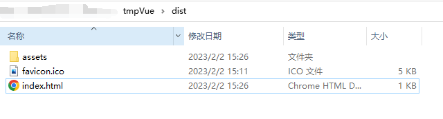
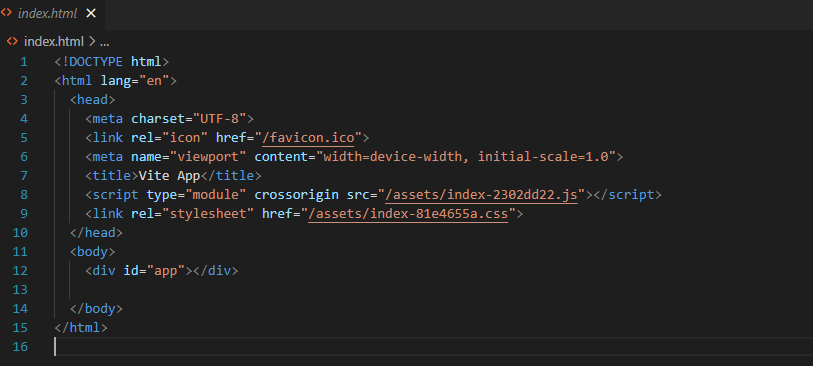

# Vue

https://cn.vuejs.org/

按照上面的官方文档写一个简单的网页是不难的，所以如果在这篇文章中一步一步讲 vue 怎么写就有些赘余。这篇文章会关注一些别的东西

## Vue 与 React 的区别

Vue 是尤雨溪在吸收了 React、Angular 的部分内容后开发的轻量级前端框架。与 React 相比，Vue 的官方文档质量更好，也更简单易上手。React 在编码上更加 OOP，有用到 js class、state、函数式编程等概念，由后端入手会更容易理解。并且由于 React 是 Facebook 开发的，在全球范围内的生态更好，各个大厂基本上用的前端技术栈都是 React。

因此我个人推荐的学习路线是，自己使用 Vue 进行轻量级的网页开发，再转而使用 React，从而对 js 和 oop 有更深的理解，在就业面试大厂上也有更大优势。

## 开发环境配置

包含 vscode 各类插件等

参见[开发环境搭建](https://xn4zlkzg4p.feishu.cn/wiki/wikcnry4frFfO1pCvuMcpYAYTDd)

## Vite 框架

进行较大规模的 vue 项目开发时，建议使用 vite 脚手架，参见[vite](https://xn4zlkzg4p.feishu.cn/wiki/wikcnLErEIZLBOrnn6iYwssw0Lg)

## Vue 是怎么组织的

我们使用 `npm init vue@latest` 命令来构建我们的 vue 项目（个人感觉这个是最好上手的，实际上已经在使用 vite 框架了）


文件基本架构如图所示

一般而言，我们将静态媒体文件（图片、视频）等放在 public 目录下，将 vue 源文件置于 src 目录下。

而 src 目录中，views 用于存放各个主页面，components 存放组件，router 用于存放 vue-router 路由，assets 则是存放一些其他静态媒体文件。

而 main.js 主要用于引入外部 package 的内容，App.vue 则是作为该页面的主入口

## 单个 vue 文件的各个部分

一个 vue 文件与将 html+css+js 集合在一起的 html 文件非常类似，大致分为三部分:template script style。

### 入口 App.vue

```HTML
<script setup>
import { RouterLink, RouterView } from 'vue-router'
import HelloWorld from './components/HelloWorld.vue'
</script>

<template>
    <div class="AppContainer">
        <HelloWorld :msg="myMsg">
        </HelloWorld>
    </div>
</template>
<script>
export default {
  name:"App",
  data:(){
      return{
          myMsg:"Hello!"
      }
  },
  mounted(){
      this.InitMsg()
  },
  methods:(){
      InitMsg(){
          this.myMsq="Hi!"
      }
  }
}
</script>
<style scoped>
.AppContainer{
    display:flex;
}
</style>
```

### 组件(Component)HelloWorld.vue

```HTML
<template>
  <div class="greetings">
    <h1 class="green">{{ msg }}</h1>
    <h3>
      You’ve successfully created a project with
      <a href="https://vitejs.dev/" target="_blank" rel="noopener">Vite</a> +
      <a href="https://vuejs.org/" target="_blank" rel="noopener">Vue 3</a>.
    </h3>
  </div>
</template>
<script>

export default {
  name:"HelloWorld",
  props:{
      msg:{
          type:String,
          required:true,
          default:()=>{
              return ""
          }
      }
  }
}
</script>
<style scoped>
h1 {
  font-weight: 500;
  font-size: 2.6rem;
  top: -10px;
}

h3 {
  font-size: 1.2rem;
}

.greetings h1,
.greetings h3 {
  text-align: center;
}

@media (min-width: 1024px) {
  .greetings h1,
  .greetings h3 {
    text-align: left;
  }
}
</style>
```

- script setup
  - 这部分主要用于 import，包括组件（Component）以及一些包
  - 这里我们引用了 VueRouter 插件以及我们自定义的 HelloWorld 组件
- template
  - 描述了这个页面的各个元素的树形关系
  - 非常建议在组件外面包一层 div，因为 template 相当于把 template 中的内容粘贴至父组件中，如果没有再套一层 div，很容易在排布上与父组件的 css 产生冲突
  - **":msg"**是"v-bind:msg"的简写，这是对组件属性进行动态传参，将 data 中的 msg 对象传入至组件的 props 中应用
- script export default
  - 这里定义了组件的 js 行为
  - **props:**属性，用于从父组件接受参数
  - **data():**可以动态修改的数据
  - **methods:**函数，在上述代码中，InitMsg 函数修改了 msg 的值
  - **mounted:**在页面渲染完成后触发，也就是我们的页面渲染完成后，调用了 InitMsg 函数来修改 msg 的值，从而将该值传递到 HelloWorld 组件的 props 中，进行了动态修改
- style scoped
  - scoped 表示仅仅在该组件中生效
    - 如果想要修改 ui 库（如 element-plus）的组件格式，需要另起一块 style，并且不使用 scoped
  - 在这里确定组件的 css
  - 具体怎样进行 css 设计，可以参考这篇文章[如何优雅地使用 CSS](https://xn4zlkzg4p.feishu.cn/wiki/wikcnj36uUJfJS98nW9jSUp4eIh)

以上内容均为较为浅显粗暴的说明，仅仅是便于上手开发理解。深层次的理解需要阅读官方文档

### main.js

```JavaScript
import { createApp } from 'vue'
import App from './App.vue'//这里就调用了我们的App.vue作为入口
import router from './router'
//上三行引入各类组件
import './assets/main.css'
//引入页面主css
const app = createApp(App)
//由这个入口文件构建App

app.use(router)
//使用router组件

app.mount('#app')
// 根据传入的根组件App创建vnode；渲染vnode。
```

## Vue 产生的文件在做什么

上面的三块代码其实已经揭示了一个 Vite 框架下的 Vue 项目的流程。在 index.html 内，根据传入的根组件 App 创建 vnode，再去渲染 vnode。

这个 vnode 的内容就在 App.vue 里，而 App.vue 又调用了 HelloWorld.vue 组件，并靠下方的 js 进行动态更新，并且在页面渲染完成后，调用 InitMsg 函数来对 HelloWorld 中的 prop——msg 进行更新。

### 使用 vite 进行打包

使用`npm run build`命令进行打包后，会生成 dist 文件夹，将这个文件夹部署在服务器对应目录下即可。

我们再来看一下打包后的文件



其中 index.html 如下图所示



index.html 中留有

```HTML
<div id="app"></div>
```

作为 js 控制入口，js 经由这个入口来渲染整个页面。

在第八行我们可以看到，这里引入了 assets 中的 js 文件，来对页面内容进行控制。

也就是说，dist 内没有写死的 html 文件，都是由 js 来对 DOM 进行渲染控制的。

## 你需要在官方文档中掌握的内容

- props
- data
- computed
- v-if v-for v-bind v-on v-model
- methods

## 进阶内容

Vue Router

vuex
