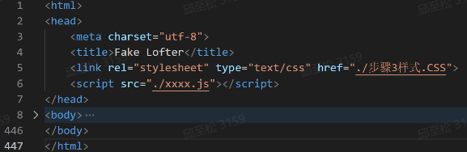

# 前端入门

## 入门方案

在前端入门部分，我们将会涉及到的部分，其实也就是下图中的这些：**三件套（基础）**、**框架**、**请求**。我们推荐你用一种“整体”的视角看待这三个部分，意思是说，明白它们在一个页面的构建中分别起到了什么样的作用（试着设想没有它们中的一个，情况会如何？），而不仅仅是在一个框架中去运用它们。


因为只是“方案”，所以这个文档里只会列出块状的知识点，以及简单讲讲它们之间的关系，为之后一段时间内大家在入门阶段需要（或者说将要）学习的内容提供参考。我们会在每一部分附上一些可供自学的材料，在需要时作为参考即可。

### 基础

前端的**三件套（HTML**/**CSS**/**JavaScript）**实际上是一切前端的基础。比如，我们仅仅使用一个.HTML文件、一个外部导入的.CSS文件和.js文件，把它们根据html要求的内容拼在一起，就可以实现一个有基本样式和行为的页面，这也是前端三件套的初始使用形态（其实可以尝试一下用这种方式写页面，这仍然是可行而且非常容易上手的）。



当然，现在我们不这么干，一般会使用前端框架提供的文件结构和构建工具来搭建前端。

但是，我们其实可以把前端框架理解成对原始的三件套进行的“**包装**”，这一层包装为页面编写提供了很多好的性质与工具，比如：数据与视图双向绑定、提供了路由、状态管理库等等。但是在这层框架下，用来编写页面的东西，归根结底还是HTML、CSS 和 JavaScript或者它们的变体（如JSX）。

对这些概念有了一定的认知之后，我们展开一下“三件套”内部的关系，简单概括就是：

**HTML和CSS确定了页面内容和样式，JavaScript创建了页面的行为。**

#### 网页布局—— HTML 和 CSS

 HTML 和 CSS 定义：把鼠标移到这两个词上就能看到简单定义了，就不手动列出了。

对于HTML和CSS在页面中的用途，我们可以这样描述：HTML是骨架，CSS负责在骨架上找到合适的“生长点”，长出需要的皮肉（好露骨的比喻x），也就是做出你想要的外观。

HTML的各类标签、CSS中的很多属性及其用途，在此不再赘述，因为它们更像是纯粹记忆性而非理解性的东西，我们在需要用到的时候能够善用搜索引擎找到它们的用法就好了。

我们可以想一想：我们最终要使用 HTML 和 CSS （且仅使用）做出的东西是什么？答案是一个无行为但外观完备的页面。为达到“**外观完备**”，这些布局方式你需要了解：

盒子模型：[盒模型 - MDN](https://developer.mozilla.org/zh-CN/docs/Learn/CSS/Building_blocks/The_box_model)

这是使用CSS布局的核心概念，对于一个给定的页面设计，首先就需要用盒子模型的思路去分析如何构建它。

flex弹性盒子 [Flex - 阮一峰](https://ruanyifeng.com/blog/2015/07/flex-grammar.html) 

grid网格布局 [grid - 阮一峰](https://ruanyifeng.com/blog/2019/03/grid-layout-tutorial.html) 

善用这两种布局方式都可以让“画页面”的过程更方便快速，并且实现页面自适应等需求。

#### 网页行为—— JavaScript

在页面的外观搞定之后，需要给页面加行为，于是就需要使用JS用编程的方式规定页面的行为。

JavaScript是一种轻量级的编程语言（HTML 只是一种标记语言），相比于C语言等，省略了很多数据类型的处理（原生JS中数据定义统一为var、let和const）。

最原始的使用JS为页面添加行为的方式是使用DOM，获取页面内元素后添加相应的动作，比如添加、修改、移除等等，当然，在使用框架编写页面时，由于框架已经封装了这些功能，所以可以比较舒服地直接使用JS进行符合开发逻辑的页面行为。对此，不同的框架对JS提供了不同的处理方法。

入门项目中使用的是React框架。在React框架中，JS 以 **JSX**的形式表示并进行网页逻辑处理。JSX 是 JavaScript 语法扩展，可以在 JavaScript 文件中书写类似 HTML 的标签。

可以用这段代码进行感性认知（**JSX =** **JS** **+** **HTML**）：

```js
    return (
        <div className='container'>
            <Form addComment={addComment}></Form>
            <div className='bar'>
                {commentList}
            </div>
        </div>
    );
```

在这里可以简单一提**TypeScript**，它是JS增加了类型注解后的超集（我们在前面说了JS是弱类型的），仅在编辑阶段起到为程序进行类型检查的作用，编译后会转化为JS。善用TS，可以在开发阶段提前发现很多问题。

### 框架

在实习阶段，我们将主要学习的是**React**框架。

在前面已经说了，前端框架可以理解成是对原始的三件套进行的“**包装**”，不同的包装方式会具有不同的特性和代码风格。而React这种包装方式，为网页编写者提供的特性有：组件层级能力、单向数据流、函数式编程、响应式更新、状态不可变……

srds，框架这种东西，如果不上手写过，很难对这些概念有什么切实的体会，所以建议在入门项目中亲自去体会吧！那里会有比这里更详细的面向开发过程的说明。

相关学习材料（当然不止这些！）：

[React 哲学 – React](https://zh-hans.react.dev/learn/thinking-in-react)（感觉讲得也挺抽象的，就姑妄看之吧）

推荐阅读：

官方文档：[快速入门](https://zh-hans.react.dev/learn)

MDN：[React入门](https://developer.mozilla.org/zh-CN/docs/Learn/Tools_and_testing/Client-side_JavaScript_frameworks/React_getting_started)

### **HTTP 协议**

到目前为止，我们需要写的页面已经外观完备、具有一定的页面行为。但还有一个问题——网页上的数据从哪里获得？我们可以假定有一个存在于远端的“**库**”，当前端需要数据时，就向这个“库”发送一个请求，“库”在收到请求后，根据前端的需要，为其提供所需的数据。

上面讲的这一系列流程，其实模拟的就是前端与后端协作的过程。

**请求**是连接前端和后端的“桥梁”。当前端需要在网页上动态渲染数据的时候，前端向后端发送 HTTP 请求以获取数据。像浏览器这样的客户端发出的消息叫做**请求（request）**，服务端返回的消息叫做**响应（response）**。

HTTP协议是一种无状态协议，“无状态”的意思是，每次请求都是独立的。

一条HTTP请求的基本部分包括：

- 请求方法：常用的请求方法有GET，POST
  - **GET**：GET 请求用于从服务器获取资源。它通常用于读取服务器上的数据，而不会对服务器状态造成影响。GET 请求将参数（params）附加在 URL 的末尾，以便服务器根据这些参数返回所需的资源。
  - **POST**：POST 请求用于将数据发送到服务器以创建或更新资源。与 GET 请求不同，POST 请求将数据作为请求的主体（body）发送，而不是将数据附加在 URL 的末尾。这使得 POST 请求可以发送更大量的数据，而且相对更安全——因为 POST 请求中的数据既不会出现在 URL 中，也不会被缓存。
- URLs：URL 是用于在互联网上定位和访问资源的字符串，通常由多个部分组成，包括协议（如HTTP或HTTPS）、主机名（域名）、端口号（可省略）、路径、查询参数等。一般格式为：`<scheme>://<authority><path>?<query>`
- 状态码：状态码由服务端返回，不同的状态码表现了服务器的不同状态，例如我们熟悉的404，表示的是所访问的资源不存在。

HTTP | MDN ：[HTTP](https://developer.mozilla.org/zh-CN/docs/Web/HTTP)

### Fetch API

在HTTP协议部分，我们讲了概念化的请求，而Fetch API 是一个具体的请求接口，用于访问和操纵 HTTP 的请求和响应等部分，它也是我们在React框架中一般用来发送请求的接口。

Fetch API 提供了一个全局 **`fetch()`** 方法，该方法提供了一种简单、合理的方式来跨网络异步获取资源，替代了原先使用`XMLHttpRequest`的方式，用基于`Promise`的异步（.then()，或是 async, await ）代替了基于`callback`的异步，使得异步请求不需要过多嵌套层数。当然，它还提供了很多别的优点，在此不再赘述。

举例一个`fetch()`的使用例子：

```js
const arg = { userId: 1 };
const data = await fetch('https://example.com/profile', {
  method: 'POST', // or 'PUT'请求方法
  headers: {
    'Content-Type': 'application/json',
  },
  body: JSON.stringify(arg),//请求体
})
.then(response => response.json());//把返回格式转成json
```

更多信息可参见（首先会用就可以啦）：

使用Fetch：[Using Fetch](https://developer.mozilla.org/zh-CN/docs/Web/API/Fetch_API/Using_Fetch)

### **SWR**

终于到了最后一部分！我们已经可以通过`fetch()`方法向后端发送请求来获取需要的数据了，因此一个完整的web页面（前端部分）已经可以被构建起来。我们可以把SWR理解成是对已有的这一套请求过程的进一步优化。

SWR 是由 [Next.js](https://nextjs.org/)（React 框架）背后的同一团队创建的**用于数据请求的 React Hooks 库，**它解决的是`fetch()`在React应用中，多个组件同时发送同一个请求以获取数据的问题，在这一情境下，多次发送同一个请求会导致网络流量的浪费。当然我们也只发送一个请求，然后将所获得的数据通过透传的方式传递给其他组件进行渲染，但这与React的单向数据流的原则是相悖的，并不是一种优雅的处理办法。

在这一情景下，**SWR** 被提出用于解决 React 开发中的这一问题。

它使用`useSWR()`钩子，提供了一层缓存层用以解决这个问题（可以理解为，把第一个获得的请求结果放入缓存层，之后对于相同的请求可以直接向缓存层取数据），SWR默认只有 **GET** 请求（如果需要发送 POST 请求的话，也可以将 POST 请求，然后用`mutate`修改缓存）

一个简单的示例：

```js
// ./components/Avatar.jsx
import { useUser } from '../modal.js';
const { user, isLoading, isError } = useUser(id)

// ./modal.js
export function useUser(id) {
  const { data, error, isLoading } = useSWR(`/api/user/${id}`, fetcher)
 
  return {
    user: data,
    isLoading,
    isError: Boolean(error),
  }
}
```

官方文档：[SWR](https://swr.vercel.app/zh-CN)