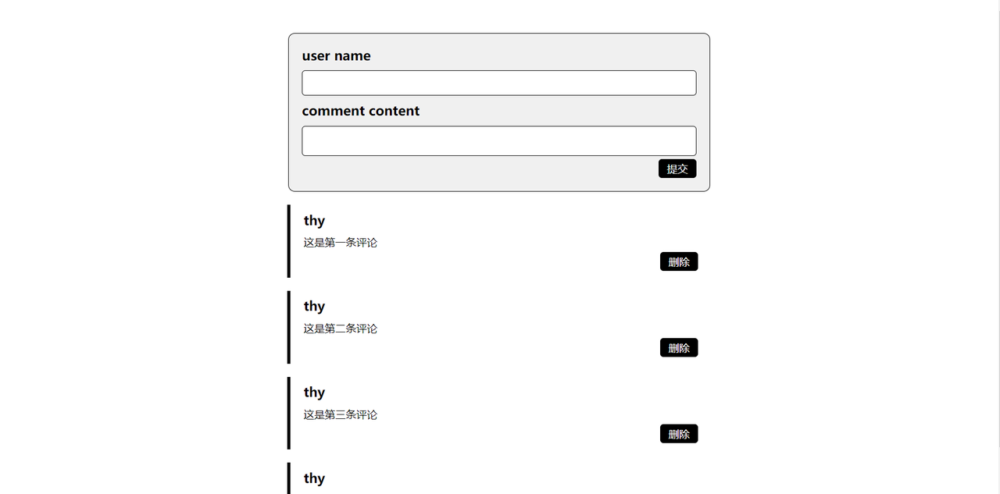
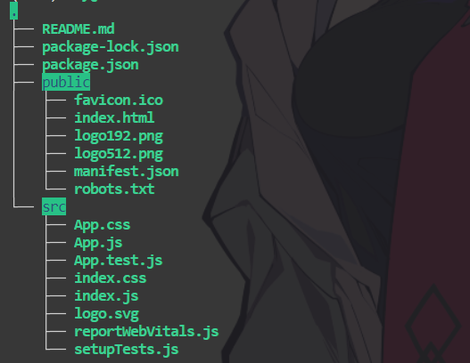
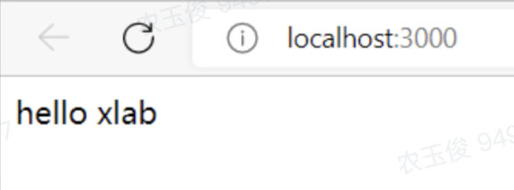

# 前端入门实践

## 负责人

## 总览

我们的最终目标是完成一个如下所示的评论区，用户可以在上方输入框中输入评论的用户名 & 评论内容，点击提交按钮发送评论，发送的评论需要展示在下方

思考题：

1. 看到这张示意图，你会怎样设计组件的树状结构
    



## 初始化代码开发环境

由于`react`只是一个用于构建用户界面的`JavaScript`库,我们需要使用一种框架以初始化代码运行环境,目前主流的react框架包括但不仅限于以下几种:

- Create React App
    
- Vite
    
- Next.js
    

我们采用官网推荐的Create React App框架

在命令行输入以下代码初始化react环境:`npx create-react-app comment_area`

初始化完毕后，当前目录下会多出一个`comment_area`文件夹,其中文件结构如下:



我们再通过如下步骤搭建一个空白的开发环境

1. 进入`src`文件夹,删除所有文件
    
2. 在`src`目录下新建以下两个文件夹:`pages`,`style`
    
3. 在`pages`文件夹中新建`App.js`文件
    
4. 在`src`目录下新建`index.js`文件
    
5. 在`App.js`文件中输入以下代码:
    

```JavaScript
export default function App() {
     return (
         <div>
             hello xlab
         </div>
     )
 }
```

6. 在`index.js`文件中输入以下代码
    

```JavaScript
import { createRoot } from 'react-dom/client';
 import App from './pages/App';

 const container = document.getElementById('root');

 if(container) {
     const root = createRoot(container);
     root.render(<App/>);    
 }
```

7. 在命令行运行`npm start`,你将会看到以下内容
    



> pages文件夹中存放页面文件,style文件夹中存放css文件

至此你已经完成了一个起步demo，接下来你需要做的就是在这个空白框架的基础上完成我们的项目

对于初学者，我们推荐看以下几个教程入门

1. MDN
    
2. 廖雪峰的博客
    
3. 菜鸟教程
    

在这里我们仅简要的介绍一下MDN:

> MDN Web Docs is an open-source, collaborative project documenting Web platform technologies, including [CSS](https://developer.mozilla.org/en-US/docs/Web/CSS), [HTML](https://developer.mozilla.org/en-US/docs/Web/HTML), [JavaScript](https://developer.mozilla.org/en-US/docs/Web/JavaScript), and [Web APIs](https://developer.mozilla.org/en-US/docs/Web/API/). We also provide an extensive set of [learning resources](https://developer.mozilla.org/en-US/docs/Learn) for beginning developers and students.

MDN官网：https://developer.mozilla.org/

为了完成这个项目，我们推荐你先看一下本文档中的React部分，在对React有了一定的了解后再按HTML -> CSS -> JavaScript的步骤完成整个项目

## HTML部分

> 超文本标记语言 (英语：Hypertext Markup Language，简称：HTML ) 是一种用来结构化 Web 网页及其内容的标记语言。网页内容可以是：一组段落、一个重点信息列表、也可以含有图片和数据表。—— MDN

HTML 中结构化地定义了很多的元素，它们有着树型结构关系，是构建网页的基石。

- MDN Learn HTML：https://developer.mozilla.org/en-US/docs/Learn/HTML
    
- MDN HTML Reference：https://developer.mozilla.org/en-US/docs/Web/HTML
    

#### 最佳实践

我们先完成评论输入框的HTML部分，修改`App.js`文件，使用`<div>,<h3>,<input>`标签构建以下界面


## CSS部分

CSS(Cascading Style Sheet)，用于为网页添加样式

你可以在以下网站上学习CSS

- https://developer.mozilla.org/zh-CN/docs/Learn/Getting_started_with_the_web/CSS_basics
    
- https://www.runoob.com/html/html-css.html
    

对于这个入门项目，你只需要关注CSS中的这些内容:

- 盒子模型
    
- flex布局
    
- CSS选择器
    

在这一步，我们需要完成项目的样式编写，最终的效果如下图所示(请注意在这里我们还没有为按钮添加上JavaScript代码，也就是还没有交互功能)


#### 最佳实践

对于输入框部分，你可以遵循以下步骤完成样式的编写

1. 为每个元素添加自定义的className
    
2. 在style文件夹中新建`style.css`文件，在`App.js`中使用`import '../style/style.css';`引入样式
    
3. 使用height & width设置元素宽高
    
4. 使用border属性为输入框添加边框，使用border-radius添加圆角
    
5. 使用background-color添加背景颜色
    
6. 使用flex布局调整输入框中元素的布局
    
7. 使用padding设置输入框外边框
    
8. 使用margin调整元素之间的距离
    

对于单条评论部分，你可以遵循以下步骤完成样式编写

1. 参考HTML部分的介绍，完成单条评论的HTML编写
    
2. 使用border属性设置评论左侧黑色边框
    
3. 为元素设置hover属性，为每条评论添加hover效果，可以参考这个网站的拟态特效(https://neumorphism.io/#e6eef4)
    

## JavaScript部分

JavaScript 是一门编程语言，可为网站添加交互功能（例如：游戏、动态样式、动画以及在按下按钮或收到表单数据时做出的响应等）

你可以在以下网站上学习JavaScript

- https://www.liaoxuefeng.com/wiki/1022910821149312/1023020895584256
    
- https://developer.mozilla.org/zh-CN/docs/Learn/Getting_started_with_the_web/JavaScript_basics
    

对于这个入门项目，你只需要学习JavaScript的基础内容

- 基本语法
    
- 数据类型 & 变量
    
- 条件判断 & 循环
    

#### 最佳实践

在上一步的基础上，你可以遵循以下步骤为输入框添加功能：

1. 使用`useState`钩子函数初始化`username`以及`content`变量
    
2. 为两个输入框添加事件监听函数(`onChange/onBlur`),在事件监听函数中修改第一步声明的变量已完成获取用户输入的功能
    
3. 为确认按钮添加`onClick`事件监听函数，由于本项目没有与后端的交互，你可以简单地把获取到的数据使用`localStroage.setItem()`储存在`localStroage`中
    
4. 可选：为了完善用户体验，你可以考虑在点击确认按钮后清除输入框中的内容
    

完成了了输入框的功能以后，你可以遵循以下步骤完成展示评论的功能：

1. 使用`localStroage.getItem()`获取储存在`localStroage`中的评论数据
    
2. 将你之前写的单条评论编写为一个`Comment`组件，接受`use``rname，content，index`作为组件参数的输入，并展示`u``s``ername`以及`content`
    
3. 在`Comment`的父组件中遍历第一步获取到的评论数据，将每条评论以`Comment`组件的形式返回
    
4. 为了完成删除功能，你需要获取每条评论的`id`，在这里我们以`index`作为评论的`id`，通过删除`localStroage`中对应`index`的评论以完成删除评论的功能
    

## React部分

React是一个用于构建用户界面的JavaScript库，我们推荐你直接在React官方网站上学习React

- https://react.docschina.org/
    

对于这个入门项目，你需要了解react中的如下内容:

- JSX
    
- 元素渲染(推荐阅读:https://blog.skk.moe/post/react-re-renders-101/)
    
- 组件 & props
    
- React hooks（本项目中使用useState就足够了）
    

如果你还想进一步学习前端方面的知识，你可以参考这个网站中的学习路线:https://roadmap.sh/frontend

思考题:

1. React组件之间是如何传递参数的？
    
2. React不同组件的层次关系是什么样的？
    

## Bonus

以下列出来的bonus仅供参考，如果你有更好的想法也可以无视它们

### 样式

1. 为不同评论的左边栏设置不同的颜色
    
2. 采用tailwind进行样式编写
    
3. 学习使用material ui / antd中的组件完成项目
    

### 功能

1. 学习用redux进行评论状态更新的状态管理
    
2. 为评论增加编辑功能